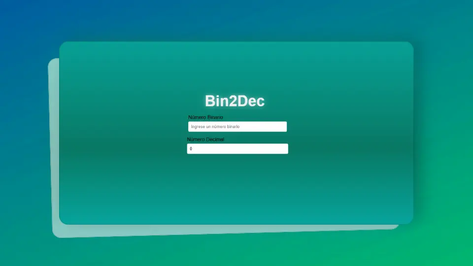

# Bin2Dec

**Nivel:** 1-Beginner

Bin2Dec es una aplicación que permite a los usuarios convertir números binarios en su equivalente decimal. Esta herramienta es útil para comprender y practicar las conversiones entre sistemas numéricos binarios y decimales.

## Descripción

La aplicación permite al usuario ingresar una cadena de hasta 8 dígitos binarios (compuestos por '0's y '1's) y muestra su equivalente en decimal. Si el usuario ingresa un valor no binario, se muestra una notificación de error.

## Características

- Conversión de números binarios de hasta 8 dígitos a decimal.
- Validación de entrada para asegurar que solo se ingresen dígitos binarios.
- Interfaz de usuario intuitiva y responsiva desarrollada con Angular.

## Tecnologías Utilizadas

- Angular
- TypeScript
- HTML5
- CSS3

## Instalación y Uso

1. Clona este repositorio:

   ```bash
   git clone https://github.com/pablomil2000/Bin2Dec.git
   ```



2. Navega al directorio del proyecto:

   ```bash
   cd bin2dec
   ```



3. Instala las dependencias:

   ```bash
   npm install
   ```



4. Inicia la aplicación:

   ```bash
   ng serve
   ```



5. Abre tu navegador y visita `http://localhost:4200/` para ver la aplicación en funcionamiento.

## Capturas de Pantalla



## Próximas Mejoras

- Implementar la conversión de decimal a binario.
- Añadir soporte para números binarios de más de 8 dígitos.
- Mejorar la accesibilidad de la interfaz de usuario.

## Contribuciones

Las contribuciones son bienvenidas. Por favor, sigue los siguientes pasos:

1. Haz un fork del proyecto.
2. Crea una nueva rama (`git checkout -b feature/nueva-caracteristica`).
3. Realiza tus cambios y haz commit (`git commit -m 'Añadir nueva característica'`).
4. Sube tus cambios a tu fork (`git push origin feature/nueva-caracteristica`).
5. Abre un Pull Request en este repositorio.

## Licencia

Este proyecto está bajo la Licencia MIT.